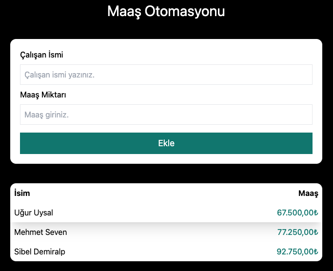
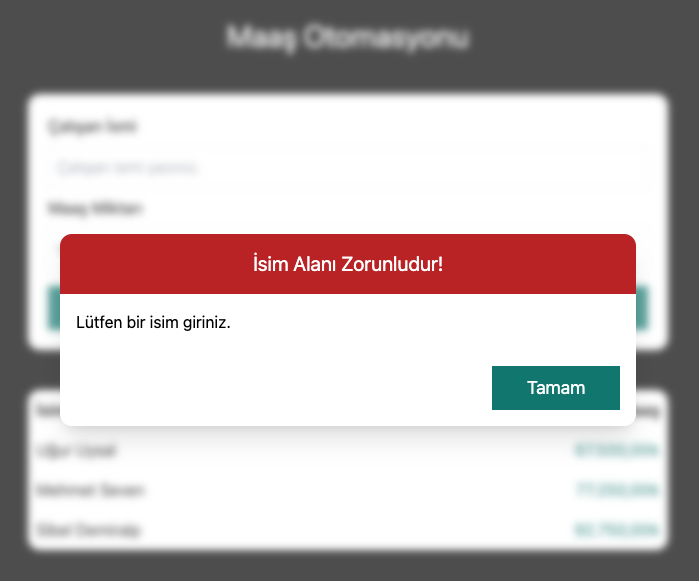
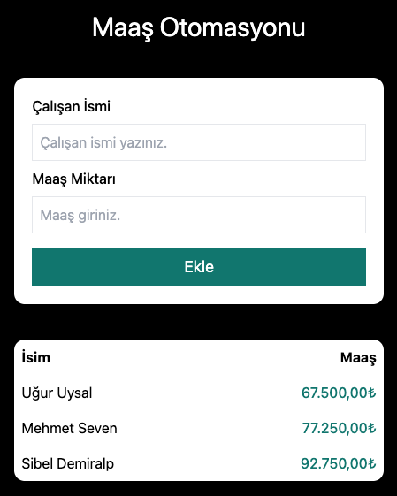

# Workers App

Çalışan maaş otomasyonu uygulaması.

Bu proje, çalışanların maaş ve bordro gibi temel işlemlerini yönetmek için geliştirilen bir web uygulamasıdır. Ön yüz React ile oluşturulmuştur ve kullanıcıların çalışan bilgilerini görüntüleme / düzenleme gibi temel ihtiyaçlarını karşılar.

---

## 🚀 Teknolojiler

Bu projede kullanılan başlıca teknolojiler:

- **React** – UI bileşenleri için
- **JavaScript (ES6+)**
- **Create React App** – proje yapısı ve development tooling
- **Tailwind CSS** – stil ve layout
- **npm** – paket yönetimi

---

## 📦 Kurulum

Projeyi yerel makinenizde çalıştırmak için:

```bash
# Repoyu klonla
git clone https://github.com/ugur-uysal/workers-app.git

# Klasöre gir
cd workers-app

# Paketleri yükle
npm install

# Geliştirme sunucusunu başlat
npm start

## UI ekran görüntüleri
<p align="center">
  
  
  
</p>
```
